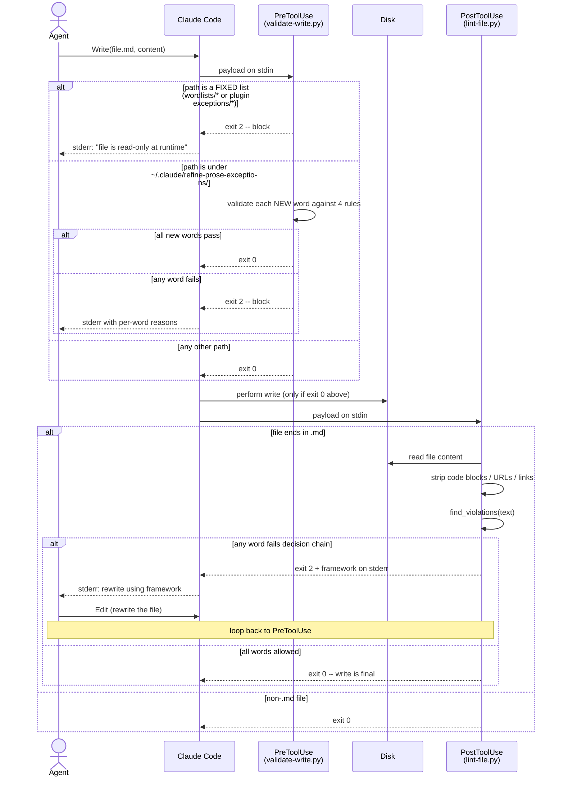
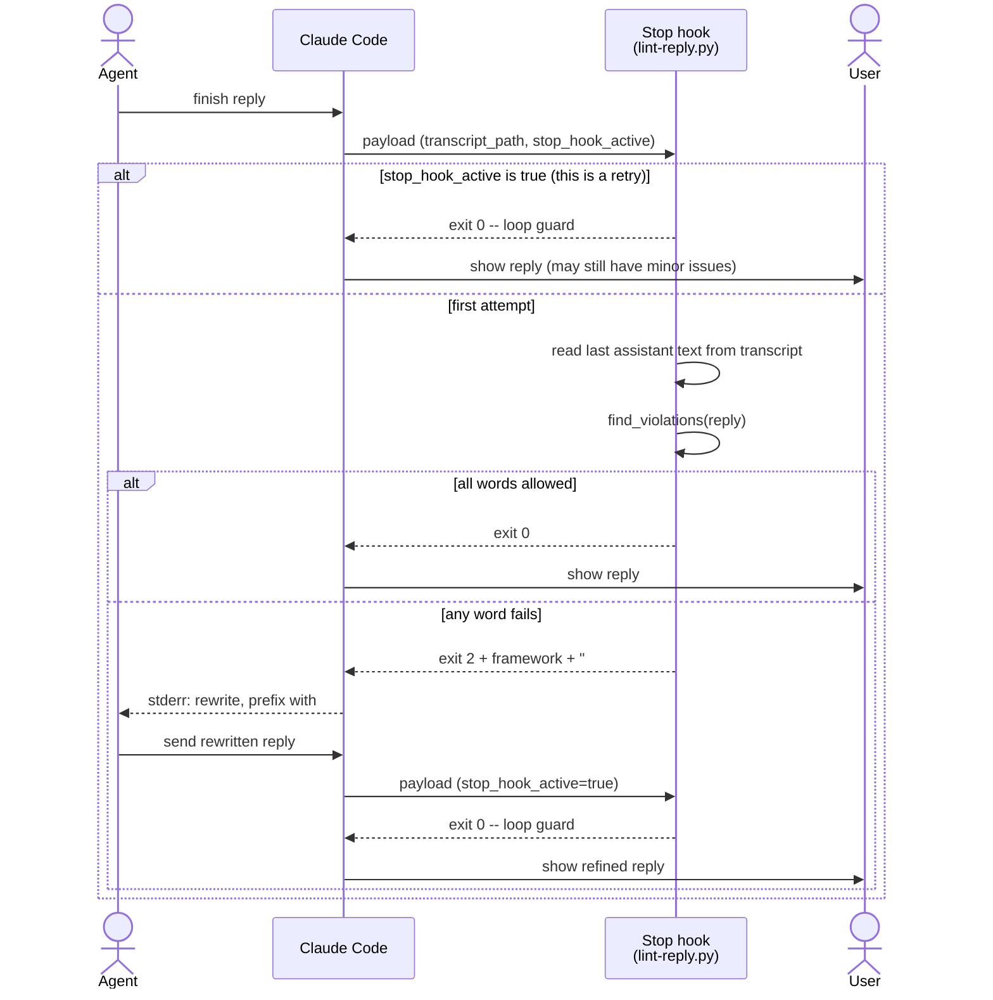
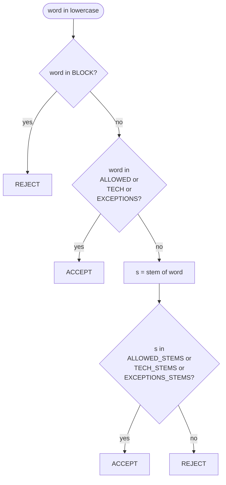
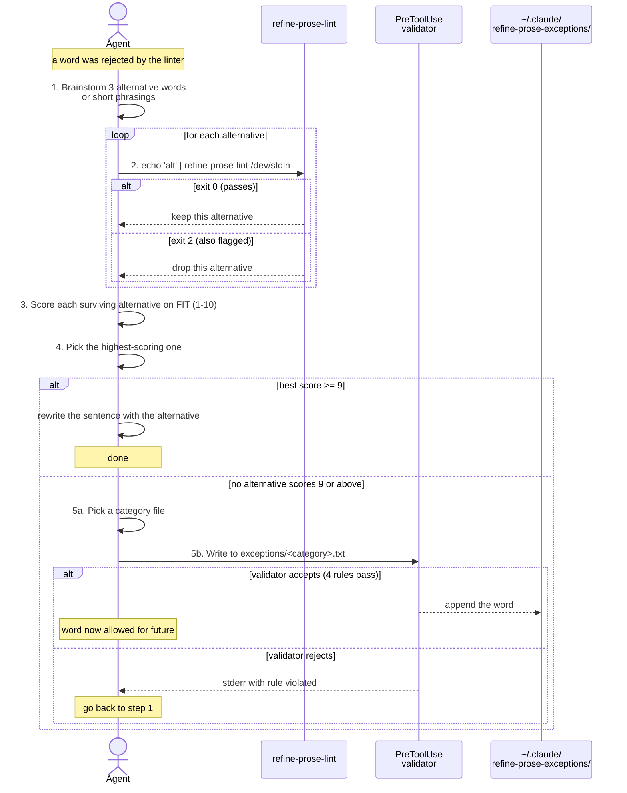

# refine-prose

A Claude Code plugin that keeps AI output to common spoken English plus real technical terms.

If you do not say it out loud, do not write it. That is the rule this plugin enforces.

## What it does

Three hooks run automatically when the plugin is enabled:

| Hook | When it fires | What it does |
|------|--------------|--------------|
| `PreToolUse` on `Write`, `Edit`, `MultiEdit` | Before a file write or edit | Rejects writes to the plugin's fixed lists. Validates writes to your personal exceptions folder word by word. |
| `PostToolUse` on `Write`, `Edit`, `MultiEdit`, `NotebookEdit` | After the agent writes or edits a Markdown file | Lints the file. If words fall outside the allowlist, returns the report to the agent so it rewrites. |
| `Stop` | After the agent finishes a reply | Lints the reply text. If words fall outside the allowlist, blocks the reply and asks for a rewrite that starts with the `## Refined` header. |

Hooks exit with status 2 on a violation. Claude Code routes that to the model as a system message, and the model reacts. You are not prompted.

## Hooks overview

### File write sequence



### Reply sequence



The PreToolUse validator protects three categories of paths:

```
FIXED  (write blocked outright)
  plugin/wordlists/ngsl-nawl-combined.txt
  plugin/wordlists/tech-terms.txt
  plugin/wordlists/block.txt
  plugin/exceptions/*.txt

GATED  (write allowed only if every new word passes 4 rules)
  ~/.claude/refine-prose-exceptions/*.txt

OPEN   (validator ignores)
  anything else
```

## The lists

Three lists ship with the plugin and never change at runtime:

| File | Holds |
|------|-------|
| `wordlists/ngsl-nawl-combined.txt` | NGSL + NAWL flattened. 11,075 forms of everyday and academic English. |
| `wordlists/tech-terms.txt` | Real technical jargon only: protocols, languages, frameworks, engineering vocabulary. About 150 entries. |
| `wordlists/block.txt` | Fancy LLM-coded words always rejected, even when they appear in NGSL or NAWL. About 110 entries. |

The bundled `exceptions/` folder ships with categorized starter files. These are also fixed at runtime:

| File | Holds |
|------|-------|
| `exceptions/numbers.txt` | Number words NGSL drops by design (`zero`, `two` ... `million`). |
| `exceptions/ordinals.txt` | Ordinal words (`first`, `second` ... `twelfth`). |
| `exceptions/days-and-months.txt` | Calendar words. |
| `exceptions/brands.txt` | Brand and product names common in tech docs. |
| `exceptions/file-formats.txt` | File extensions (`md`, `png`, `csv`, etc.). |
| `exceptions/streams.txt` | POSIX standard channels. |
| `exceptions/plugin-internal.txt` | Words the plugin itself uses. |
| `exceptions/places.txt` | Countries, regions, common cities, US state codes. |
| `exceptions/business-abbreviations.txt` | `q1`, `fy`, `llc`, `ceo`, `ebitda`, etc. |
| `exceptions/units.txt` | `kb`, `mb`, `ghz`, `ms`, `psi`, etc. |
| `exceptions/academic-citations.txt` | `etc`, `eg`, `ie`, `viz`, `et`, `al`, etc. |
| `exceptions/regional-spellings.txt` | British/Canadian/Australian variants (`colour`, `organise`, `centre`). |

Your personal exceptions live in a folder that grows over time:

```text
~/.claude/refine-prose-exceptions/
```

Drop categorized files in there. Every `.txt` file is loaded and merged with the bundled categories. The PreToolUse validator gates writes to this folder, so the agent cannot turn it into an escape hatch for fancy English.

## The decision chain (per word)

For every word in the prose, in this order:



Block beats allow. Exact match beats stem. Stem is the fallback.

## Decision process when a word is rejected

This is the sequence the agent follows for every rejected word, as written into the hook stderr message:



The framework removes the agent's discretion: every rejection has a defined process, and the validator is the final gate on additions. There is no hand-curated swap list anywhere in the plugin. The model finds its own alternatives and verifies them with the linter.

### Fit-score reference

| Score | Meaning |
|-------|---------|
| 10 | Means exactly the same, reads naturally in this sentence |
| 7-9 | Means roughly the same, minor naturalness loss |
| 4-6 | Related but awkward here |
| 1-3 | Unrelated or wrong |

Only score 9 and above counts as a clean rewrite. Anything below triggers fallback to step 5 (categorize and add).

## How additions are intercepted

The PreToolUse hook validates every write. A write is rejected if any of these are true:

- The target is one of the three fixed lists (`ngsl-nawl-combined.txt`, `tech-terms.txt`, `block.txt`) or a file in the bundled `exceptions/` folder. These files are read-only at runtime.
- The target is in `~/.claude/refine-prose-exceptions/` and any new word in the proposed content:
  - is not a single lowercase token (use `[a-z]` with optional hyphens)
  - is on the blocklist (block always wins)
  - is already in NGSL+NAWL or tech-terms (no exception needed)
  - has a stem already in NGSL+NAWL stems or tech-terms stems (already covered by the stem fallback)

## The Refined header

When the Stop hook blocks your first reply, the hook message tells the agent to start the rewrite with a single line containing `## Refined` followed by a blank line. That marker tells you the reply was caught by the linter and rewritten, so you know which replies to read more carefully.

The marker is best effort -- it relies on the model following the instruction in the hook message. It is not enforced after the fact.

## Install

### From source (during development)

```bash
claude --plugin-dir /path/to/agent-skills/packages/plugins/refine-prose
```

### As an installed plugin

Once published:

```text
/plugin install refine-prose
```

## Usage

After installing and starting Claude Code, the plugin runs in the background. There is nothing to invoke.

You can also run the linter on a file by hand:

```bash
refine-prose-lint path/to/file.md
```

Exit code 2 with the bad words on stderr means the file fails. Exit code 0 means it passed.

## Optional dependency

For the most accurate stem matching, install the Snowball stemmer:

```bash
pip install snowballstemmer
```

Without it, the plugin falls back to simple suffix stripping. The fallback works for most cases but is less accurate for irregular forms.

## Tuning

| You want to ... | Do this |
|-----------------|---------|
| Allow a real technical term not in the bundled lists | Put it in `~/.claude/refine-prose-exceptions/<category>.txt`. The validator confirms it is not redundant or blocked. |
| Lint more file types than `.md` | Set `PLAIN_PROSE_EXTS=".md,.mdx,.txt"` in your shell env |
| See what gets flagged on an existing file | `refine-prose-lint your-file.md` |
| Disable the reply hook | Remove the `Stop` block from `hooks/hooks.json` after install (or fork the plugin) |

## Bundled files

```text
refine-prose/
├── .claude-plugin/
│   └── plugin.json
├── hooks/
│   └── hooks.json
├── bin/
│   ├── refine-prose-lint           # PostToolUse entry point
│   ├── refine-prose-reply-lint     # Stop entry point
│   └── refine-prose-validate       # PreToolUse entry point
├── scripts/
│   ├── _lint_core.py               # shared logic: load lists, stem, decide
│   ├── lint-file.py                # checks .md files after a write
│   ├── lint-reply.py               # checks the model's reply on Stop
│   └── validate-write.py           # validates writes before they happen
├── wordlists/                      # the three FIXED lists (read-only)
│   ├── ngsl-nawl-combined.txt      # NGSL+NAWL flattened (11,075 forms)
│   ├── tech-terms.txt              # real technical jargon (150 entries)
│   └── block.txt                   # fancy LLM words (114 entries)
├── exceptions/                     # bundled categorized starter files
│   ├── README.md
│   ├── numbers.txt
│   ├── ordinals.txt
│   ├── days-and-months.txt
│   ├── brands.txt
│   ├── file-formats.txt
│   ├── streams.txt
│   ├── plugin-internal.txt
│   ├── places.txt
│   ├── business-abbreviations.txt
│   ├── units.txt
│   ├── academic-citations.txt
│   └── regional-spellings.txt
├── raw/                            # gitignored, NOT shipped in final product
│   ├── NGSL.json                   # upstream source
│   ├── NAWL.json                   # upstream source
│   ├── ngsl_flat.txt               # intermediate
│   ├── nawl_flat.txt               # intermediate
│   └── regenerate.sh               # rebuilds wordlists/ngsl-nawl-combined.txt
├── .gitignore
└── README.md
```

Your personal exceptions live outside the plugin:

```text
~/.claude/refine-prose-exceptions/
└── *.txt                           # categorized files you add over time
```

## License

MIT. See the repository root.
